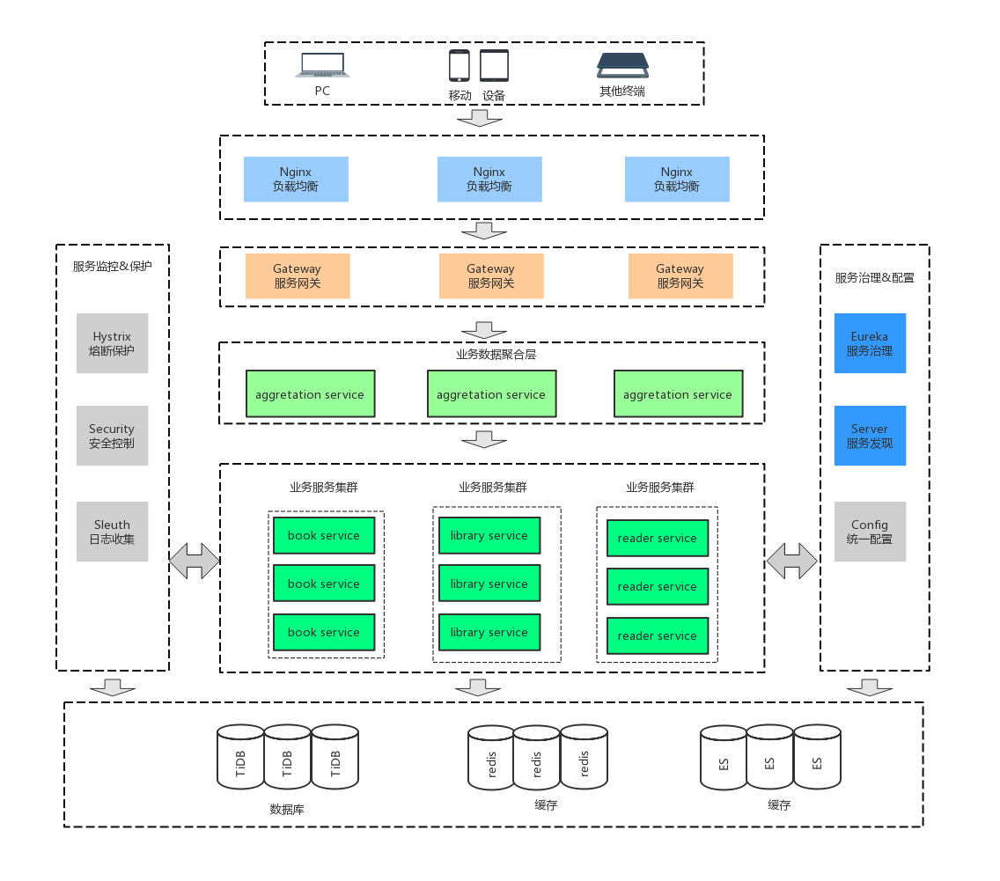

# Spring Cloud DDD Sample

Spring Cloud DDD Sample



- spring-cloud-ddd-sample
    - commons
        - 公共组件
    - eureka
        - 注册中心
    - gateway
        - 服务网关
        - 统一访问入口
        - 与注册中心结合，实现自动化的服务实例维护，路由转发
        - 实现权限校验与微服务业务逻辑的解耦
    - aggregation
        - 聚合层服务
        - 聚合多个请求返回的数据
    - book-service
        - 图书服务


使用的版本号：

```yaml
spring.version: 5.1.5.RELEASE
spring-boot.version: 2.1.3.RELEASE
spring-cloud.version: Greenwich.SR1
```
